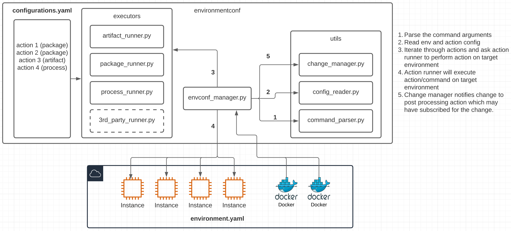

## Project architecture

Environmentconf is python based tool for doing configuration management for remote virtual machines or docker environments.

### High level architecture diagram

### Future scope

* Current implementation supports `apply` command as explained in home page. Future scope will have two additional commands as below-
    * `init` Command: It is responsible for parsing the `environments.yaml` and then add more metadata into it by querying remote machines. For example, it will query AWS and fill tags values so that `apply` command can target subset of machines from any `group`.
    * `plan` Command: It is responsible for calculating diff between state stored in state file (like terraform) and then inspect the remote environments and compare with state file. This information can be used to predict what changes tool will make in remote machines before applying the changes.
    * `apply` Command: At the moment we already have basic implementation of apply command. At the end of running action tool needs to store environment state in state file so `plan` command can use it for reference.
* Current implementation has three basic action executors `artifact`, `package` & `process`. We can extend this pattern to plugin based pattern so that tool can allow third party developers to write and register their own action executors.
* Unit test: We do not have any unit tests at the moment. We can use `Docker` container(s) environments for performing unit testing.

### Development

* Install dev dep. `pip install --user --upgrade setuptools wheel`
* Clone the repository
* Make code changes 
* Generate dist once changes are ready to be shipped. Run command `python setup.py sdist bdist_wheel`
* Push package to pypi using command `twine upload dist/*`
